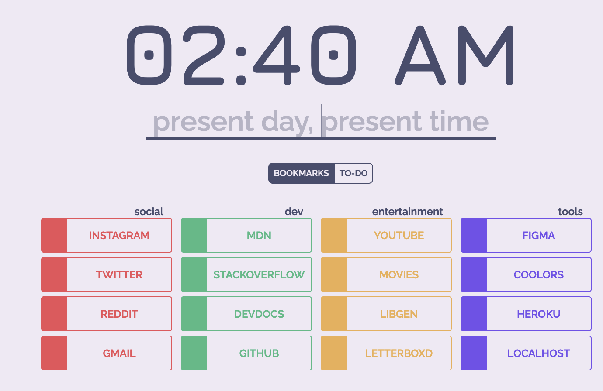

## present day, present time!
##### *a minimalist startpage*

#### [live demo](https://presentday-presenttime.herokuapp.com/)

### about

This is a new-tab start page for web browsers. It began as a need
for quicker access to a search bar with [bangs](https://duckduckgo.com/bang), as well as customizable bookmarks— but will become a sort of playground for implementation of new features and modules. It is currently tailored to my own specific needs, but my current project is to make customization accessible for the front end user.

## current roadmap

- [ ] Add light/dark mode
- [x] Add to-do module
- [ ] Add weather data in a way that fits the theme
- [ ] Add ability to control which categories are rendered via `bookmarks.js`
- [ ] Ability to control theme from front-end
- [ ] Ability to edit bookmarks from front-end

## settings

#### bookmarks

Bookmarks are currently controlled via `/bookmarks.js`. They are sorted
into four categories, `social`, `dev`, `entertainment`, and `tools`. The
component title, url, and corresponding color are currently editable.

#### search

Current search is handled with DuckDuckGo. To search Google, use the [bang](https://duckduckgo.com/bang)
functionality, i.e. '!g your_search_query'.

Ending a search query with a top-level domain name will go directly to that
address.

to go directly to a subreddit, type '/r/your_search_query'

#### to-do list

To-dos are saved in local storage.

Click once: mark as complete/undo

Double-click: delete